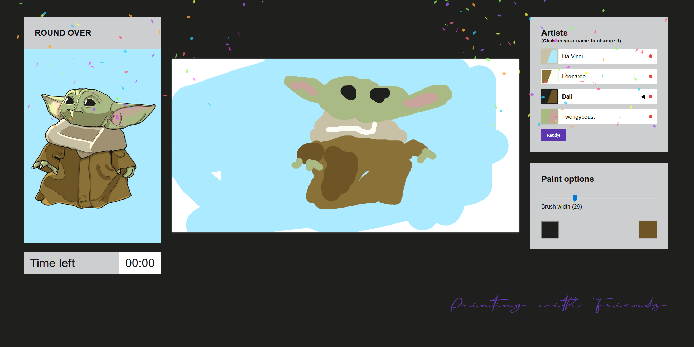

# Paint In!

🎨 [**Try it! paintin.tech**](https://paintin.tech/)

🔗 [**Devpost submission**](https://devpost.com/software/paint-in) Won the DubHacks 2020 Canvas Track!

▶️ [**Demo video**](https://youtu.be/9SUrsSgPD9o)

Paint In! is a creative and collaborative online game that tests players' abilities to work together. The objective of the game is to recreate an image or a painting that has been randomly selected. Each player is only given a limited palette of colors, so they must work together to fully accomplish the task.

The game was designed so that verbal communication is essential between the players. They do not possess an erase function or an undo function, so they must work together to quickly cover up any mistakes and move on. We've included a timing element and players can admire their great works of art after the timer ends.

The server is hosted on Azure and built with Node.js, Express, and [socket.io](https://socket.io/). We use web sockets for communication between players and the server.

